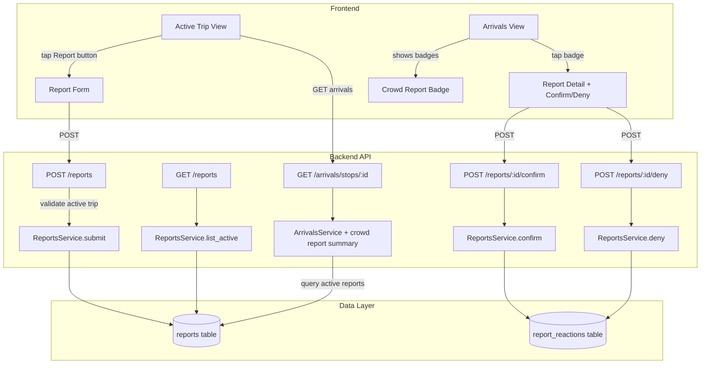
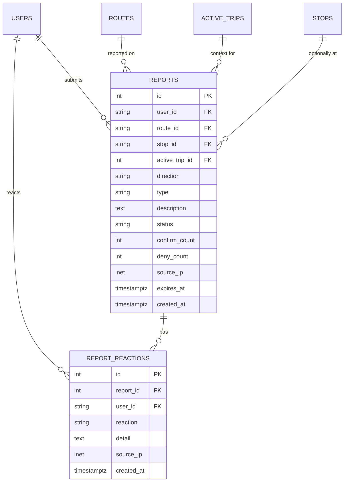
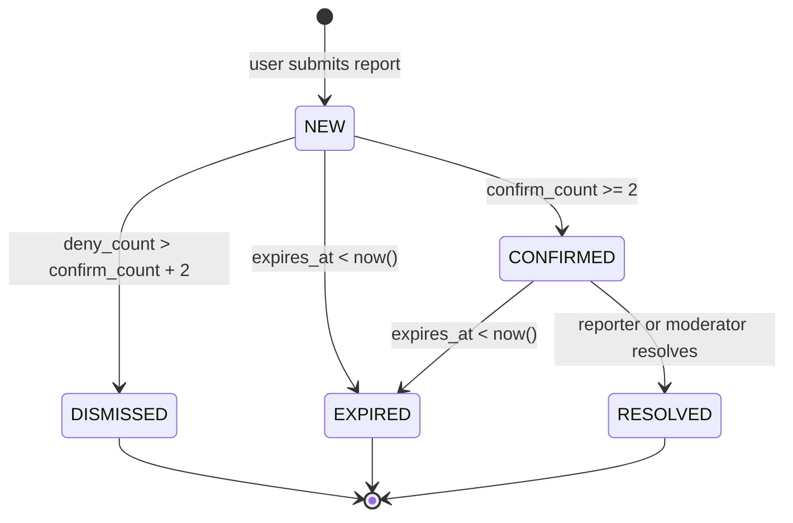
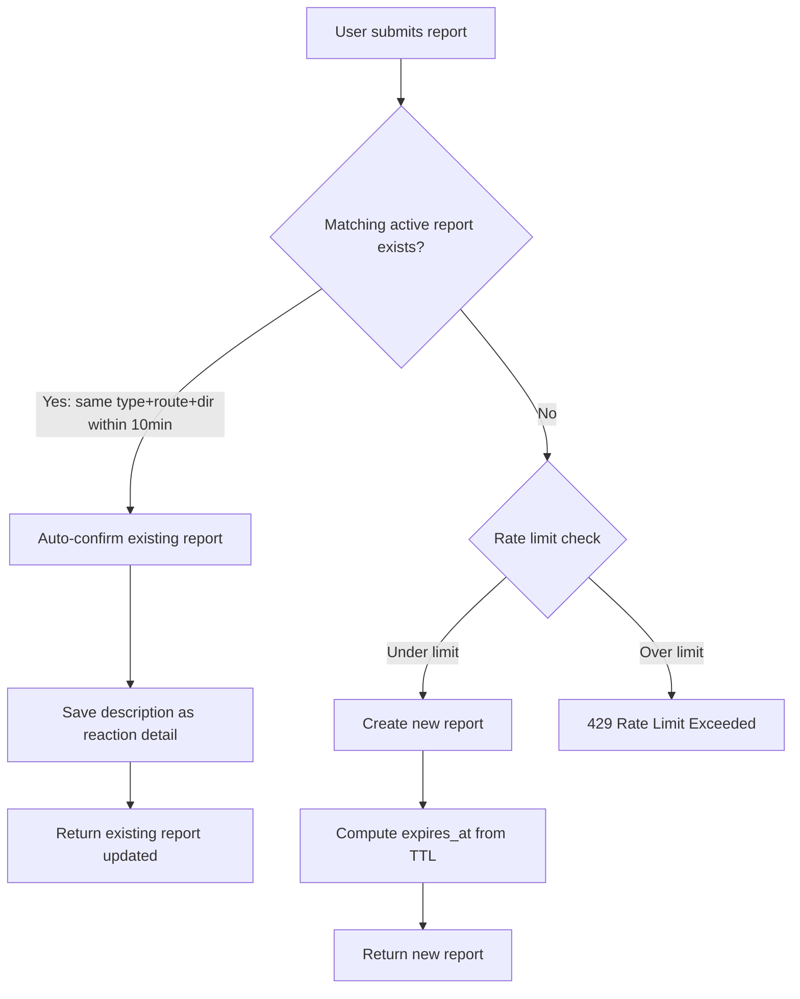
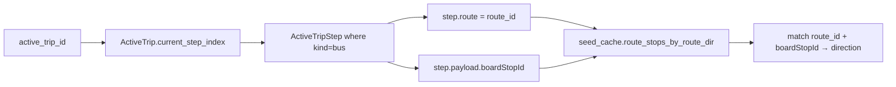

# Crowdsourcing Feature — Detailed Design

## 1. Overview

TransitPulse's crowdsourcing feature lets bus riders report real-time conditions (delays, overcrowding, breakdowns, accidents, route changes, safety issues) during an active trip. Other riders on the same route and direction can confirm or deny reports, with optional added detail. Reports surface as badges on arrival/trip cards, are filtered by relevance (same route+direction the viewer is using), and expire automatically via hybrid TTL logic.

This is TransitPulse's key differentiator: community-driven, real-time transit intelligence for a system with no official live tracking.

---

## 2. Detailed Requirements

### 2.1 Report Submission
- Users submit reports **only during an active trip** (started via `POST /planner/trips/{id}/start`)
- `route_id` and `direction` are **auto-inferred** from the active trip's current bus step
- `stop_id` is optionally inferred (nearest stop on the route)
- Report types: DELAY, BREAKDOWN, ACCIDENT, OVERCROWDING, ROUTE_CHANGE, SAFETY, OTHER
- Description is optional free text (max 500 chars)
- Both anonymous and authenticated users can report; anonymous reports carry less weight

### 2.2 Report Confirmation & Denial
- Users can **confirm** or **deny** any active report on their route+direction
- Confirmations can include optional detail text (e.g., "15 min delay", "2 buses backed up")
- One reaction per user per report (can change reaction)
- Anonymous reactions keyed by source IP
- Confirmations extend the report's expiry time

### 2.3 Report Expiry (Hybrid TTL)
- Each report type has a default TTL (see Section 6.1)
- Each confirmation extends `expires_at` by a type-specific increment
- Reports with `expires_at < now()` are considered inactive
- Moderators or the original reporter can manually resolve a report at any time
- Status transitions: NEW → CONFIRMED (when confirm_count >= threshold) → RESOLVED/EXPIRED

### 2.4 Report Deduplication
- When a new report matches an existing active report (same type + route + direction, created within 10 min), the system auto-confirms the existing report instead of creating a duplicate
- The new reporter's description is saved as a confirmation detail

### 2.5 Spam Prevention (MVP)
- Rate limiting: max 5 reports per hour per user/IP (DB-based check)
- Dedup logic prevents duplicate flood
- Confirm/deny mechanism naturally surfaces quality

### 2.6 Report Visibility & Notifications
- MVP: reports appear as **badges/icons on arrival and trip cards** when the user is viewing the affected route+direction
- Reports are **not shown** for routes/directions the user isn't currently interacting with
- Future: push notifications for users on active trips when a confirmed report appears on their route

### 2.7 Predictions Integration (Phased)
- **Phase 1 (MVP):** Soft signal only — a "riders report delays" badge alongside arrival predictions. No ETA modification.
- **Phase 2 (Future):** Confirmed delay reports feed into `DelayPrior` adjustments for real-time ETA correction.

---

## 3. Architecture Overview



---

## 4. Components and Interfaces

### 4.1 New API Endpoints

#### `POST /api/v1/reports`  (existing, modified)
Submit a report. Requires active trip context.

**Request:**
```json
{
  "activeTripId": "uuid-string",
  "type": "DELAY",
  "description": "Bus hasn't moved in 10 minutes"
}
```

**Changes from current:**
- `activeTripId` is now **required**
- `routeId` and `stopId` are removed from input (auto-inferred)
- Backend validates trip is `in_progress`, extracts route+direction from current step

**Response:** `201 Created`
```json
{
  "id": 42,
  "userId": "user-uuid" | null,
  "routeId": "400p",
  "direction": "sj_to_heredia",
  "stopId": "her_hospital" | null,
  "type": "DELAY",
  "description": "Bus hasn't moved in 10 minutes",
  "status": "new",
  "confirmCount": 0,
  "denyCount": 0,
  "expiresAt": "2026-05-18T15:30:00Z",
  "createdAt": "2026-05-18T15:00:00Z"
}
```

**Errors:**
- `404` — active trip not found or not in_progress
- `422` — invalid type
- `429` — rate limit exceeded (5 reports/hour)

---

#### `GET /api/v1/reports`
List active reports for a route+direction.

**Query params:**
| Param       | Type   | Required | Description |
|-------------|--------|----------|-------------|
| `routeId`   | string | yes      | Route to filter by |
| `direction` | string | no       | Direction filter; omit for both |

**Response:** `200 OK`
```json
[
  {
    "id": 42,
    "routeId": "400p",
    "direction": "sj_to_heredia",
    "type": "DELAY",
    "description": "Bus hasn't moved in 10 minutes",
    "status": "confirmed",
    "confirmCount": 3,
    "denyCount": 0,
    "expiresAt": "2026-05-18T16:00:00Z",
    "createdAt": "2026-05-18T15:00:00Z",
    "latestDetail": "About 15 min behind schedule"
  }
]
```

**Filters applied server-side:**
- Only reports where `expires_at > now()` and `status` not in (`resolved`, `dismissed`)

---

#### `POST /api/v1/reports/{id}/confirm`
Confirm a report with optional detail.

**Request:**
```json
{
  "detail": "About 15 min behind schedule"
}
```

`detail` is optional, max 500 chars.

**Response:** `200 OK` — returns updated report (same shape as submit response)

**Side effects:**
- Creates `ReportReaction(reaction="confirm")`
- Increments `Report.confirm_count`
- Extends `Report.expires_at` by type-specific increment
- If `confirm_count >= 2` and status is `new`, transitions status to `confirmed`

---

#### `POST /api/v1/reports/{id}/deny`
Deny a report.

**Request:**
```json
{}
```

**Response:** `200 OK` — returns updated report

**Side effects:**
- Creates `ReportReaction(reaction="deny")`
- Increments `Report.deny_count`
- If `deny_count > confirm_count + 2`, transitions status to `dismissed`

---

### 4.2 Modified Endpoint: Arrivals

#### `GET /api/v1/arrivals/stops/{stop_id}`

**Change:** Each `ArrivalOut` gains an optional `crowdReports` field.

```json
{
  "id": "pred_400p_her_hospital_...",
  "route": "400p",
  "kind": "bus",
  "etaSec": 420,
  "status": "ok",
  "crowdReports": [
    {
      "type": "DELAY",
      "confirmCount": 3,
      "latestDetail": "About 15 min behind"
    }
  ],
  "prediction": { ... }
}
```

`crowdReports` is `null` when no active reports exist for that route+direction. The field contains a **summary** (type + count + latest detail), not the full report objects.

---

## 5. Data Models

### 5.1 Report (modified)

New columns added to existing `reports` table:

```
direction        VARCHAR(32)    nullable    -- inferred from active trip
active_trip_id   INT            nullable    -- FK → active_trips.id
expires_at       TIMESTAMPTZ    nullable    -- computed: created_at + TTL
confirm_count    INT            default 0
deny_count       INT            default 0
```

**Index:** `(route_id, direction, expires_at)` — for querying active reports per route+direction.

### 5.2 ReportReaction (new)

```
id              SERIAL         PK
report_id       INT            FK → reports.id, NOT NULL
user_id         VARCHAR(36)    FK → users.id, nullable
reaction        VARCHAR(8)     NOT NULL ("confirm" | "deny")
detail          TEXT           nullable, max 500
source_ip       INET           nullable
created_at      TIMESTAMPTZ    server_default=now()
```

**Unique constraint:** `(report_id, user_id)` for authenticated users — one reaction per user per report.

**Index:** `(report_id, reaction)` — for counting confirms/denies efficiently.

### 5.3 Entity Relationship



---

## 6. Configuration

### 6.1 TTL Defaults

```python
REPORT_TTL_MINUTES = {
    "DELAY": 30,
    "OVERCROWDING": 20,
    "BREAKDOWN": 60,
    "ACCIDENT": 120,
    "ROUTE_CHANGE": 120,
    "SAFETY": 60,
    "OTHER": 30,
}

REPORT_CONFIRM_EXTENSION_MINUTES = {
    "DELAY": 15,
    "OVERCROWDING": 10,
    "BREAKDOWN": 30,
    "ACCIDENT": 30,
    "ROUTE_CHANGE": 60,
    "SAFETY": 30,
    "OTHER": 15,
}
```

### 6.2 Thresholds

```python
CONFIRM_THRESHOLD = 2       # confirms needed to transition NEW → CONFIRMED
DISMISS_MARGIN = 2          # deny_count must exceed confirm_count by this to dismiss
RATE_LIMIT_PER_HOUR = 5     # max reports per user/IP per hour
DEDUP_WINDOW_MINUTES = 10   # same type+route+direction within this window = auto-confirm
```

---

## 7. Error Handling

| Scenario | HTTP Status | Error |
|----------|-------------|-------|
| Active trip not found / not in_progress | 404 | `ActiveTripNotFound` |
| Invalid report type | 422 | `ValidationAppError` |
| Rate limit exceeded | 429 | `RateLimitExceeded` (new) |
| Report not found (confirm/deny) | 404 | `NotFoundError` |
| Report expired (confirm/deny) | 410 | `ReportExpired` (new) |
| Duplicate reaction (same user) | 200 | Upsert — update existing reaction |

---

## 8. Testing Strategy

### 8.1 Unit Tests
- TTL computation per report type
- Confirm/deny count logic and status transitions
- Dedup matching (same type+route+direction within window)
- Rate limit check (count query logic)
- Direction inference from active trip step

### 8.2 Integration Tests
- Full submit flow: create active trip → submit report → verify route+direction auto-populated
- Confirm flow: submit report → confirm → verify count incremented + expiry extended
- Deny flow: submit → deny past threshold → verify status = dismissed
- Dedup flow: submit report → submit same type+route within 10 min → verify auto-confirm
- Rate limit: submit 5 reports → verify 6th is rejected with 429
- Arrivals integration: submit confirmed report → GET arrivals → verify `crowdReports` field populated
- Expiry: submit report → advance time past TTL → verify not returned in list

### 8.3 Frontend Testing
- Report button appears only during active trip on bus steps
- Badge appears on arrival card when active reports exist
- Tapping badge shows report detail with confirm/deny buttons
- Confirm with detail text → verify detail appears in report list

---

## Appendix A: Data Flow — Report Lifecycle



## Appendix B: Dedup Flow



## Appendix C: Direction Inference



## Appendix D: Technology Choices

| Decision | Choice | Rationale |
|----------|--------|-----------|
| Rate limiting | DB-based count query | No new dependencies; works across workers; persistent across restarts |
| Report reactions | Separate table | Clean data model; supports detail text; enables per-user upsert |
| Notifications (MVP) | Polling via existing GET endpoints | No WebSocket needed yet; React Query handles refresh |
| TTL config | Python dict in service | Simple; no DB overhead; easy to tune |
| Dedup | Query-based matching | Reuses existing DB; no external service needed |

## Appendix E: External Research Reference

The file `docs/crowdsourcing/external_research/how-external-app-use-it.md` contains analysis of how Waze, GTFS-RT, and Transit App handle report scoring, decay, and confirmation. Key takeaways incorporated into this design:
- Three-score model (freshness, confirmation, trust) simplified to TTL + confirm_count for MVP
- Dedup is critical (FHWA flags duplicate Waze reports as a known issue)
- Reports from users physically on the route are more trustworthy (active trip requirement handles this)
- TTL values aligned with GTFS-RT staleness recommendations for similar event types
